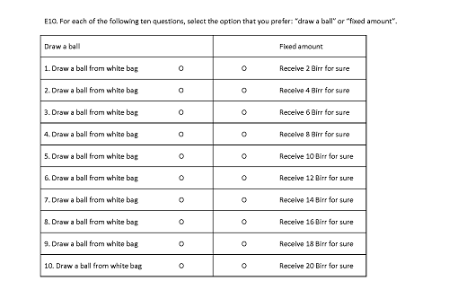

# Analysis of Risk Preference and Technology Adoption

 

#### -- Project Status: [Ongoing]

## Project Intro/Objective
The purpose of this project is to analyze the link between risk preferences of household heads and technology adoption in agriculture, based on three rounds of panel data collected in Ethiopia.

### Team Members
* Ling Yee Khor
* Orkhan Sariyev
* Tim Loos

### Methods Used
* Regression Analysis
* Household Survey
* Risk Preference Experiment

### Technologies
* R
* Stata

## Project Description
Based on data of household characteristics and risk preferences collected through three rounds of household survey and risk preference experiment, we examine the link between risk preferences of farm household heads and their adoption of various technologies and practices in their farms, such as improved seed variety, crop rotation, and irrigation.
